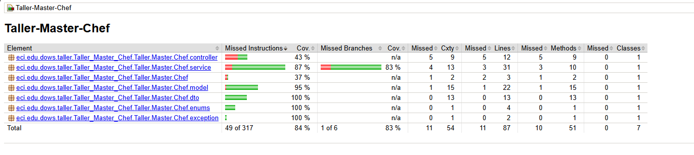

# TALLER MASTER CHEF CELEBRITY

**Hecho por :**
- Sebastian Albarracin Silva

---

#  MASTER CHEF CELEBRITY

- Un importante programa de telerrealidad de cocina va a sacar su sitio Web para que todos los televidentes puedan consultar y aprender sobre las recetas que han aparecido a lo largo de las temporadas, sin embargo, también quiere que sea interactivo, donde los televidentes pueden publicar sus recetas.Por tal motivo nuestra empresa DOSW Company ha sido seleccionada para desarrollar esta iniciativa en su Fase inicial, por lo tanto, usted va a construir una API de gestión de recetas de cocina.Cada Receta tendrá un título, una lista de ingredientes y los pasos de preparación de la receta, adicional tendrá el nombre del chef que podrá ser un concursante del programa, un chef de los jurados o un televidente del común.En caso de que sea un participante tiene que establecer en que temporada salió esa receta.
---
FUNCIONALIDADES REQUERIDAS:
- Registrar una receta de un televidente
- Registrar una receta de un participante
- Registrar una receta de un chef
- Devolver todas las recetas guardadas
- Devolver cada receta por su Numero de consecutivo
- Devolver las recetas que hicieron participantes del programa
- Devolver las recetas que hicieron televidentes del programa
- Devolver las recetas que hicieron los chefs del programa
- Devolver las recetas por temporada
- Buscar recetas que incluyan un ingrediente en especifico
- Eliminar una receta
Actualizar una receta
### Estrategia de Versionamiento y Convención de Commits

#### Flujo de Ramas (Git Flow)
- **`main`** → rama estable (producción)
- **`develop`** → integración continua (nuevas funcionalidades probadas)
- **`feature/*`** → desarrollo de nuevas funcionalidades
- **`hotfix/*`** → correcciones urgentes en producción
- **`release/*`** → preparación de releases antes de pasar a producción

#### Convención de Commits
Los commits deben ser claros, breves y con un prefijo que indique el propósito:

- **`feat:`** nueva funcionalidad
- **`fix:`** corrección de errores
- **`docs:`** cambios en la documentación
- **`style:`** formato (espacios, punto y coma, estilo de código, etc.)
- **`refactor:`** refactorización de código sin cambiar la funcionalidad
- **`test:`** adición o corrección de pruebas
- **`chore:`** actualización de dependencias, configuración o tareas varias

---

##  Tecnologías Implementadas

### Backend
- Java 17 + Spring Boot 3.x
- JUnit 5 + Mockito para pruebas
- Jacoco para cobertura
- SonarQube para análisis estático

### Herramientas
- Git & GitHub
- Swagger para documentación

---

Prueba JACOCO

